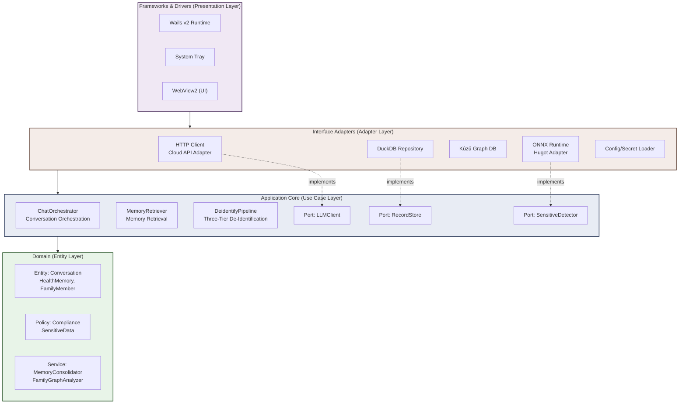

# Architecture

> 🌐 [中文版本](./i18n/zh-Hans-CN/ARCHITECTURE.md)

> This document describes MedMemo's system architecture design, module breakdown, and key decisions. Intended for development teams, technical reviewers, and open-source contributors.

---

## System Architecture Overview



Solid arrows = compile-time dependency direction (outer → inner). Dashed arrows = interface implementation relationship (adapters implement application-layer ports).

---

## Four-Layer Architecture Mapping

| Layer | Responsibility | Typical Package Path | Compile Dependency Principle |
|:------|:---------------|:---------------------|:-----------------------------|
| **Frameworks & Drivers** | Wails v2 frontend bridge, system tray, window management | `cmd/health-assistant/` | May only depend on inner interfaces |
| **Interface Adapters** | HTTP client, DuckDB/Kùzǔ repositories, ONNX inference adapters | `internal/adapters/*` | Depends on interfaces defined by Application layer |
| **Application Core** | Use case orchestration, de-identification pipeline, port definitions | `internal/application/*` | Does not depend on any outer layer or framework |
| **Domain** | Entity definitions, domain services, policy abstractions | `internal/domain/*` | **Zero external dependencies**, pure Go standard library |

---

## Core Data Flows

### User Conversation Request Flow

```
User Input
  → Wails Frontend (React)
    → Backend HTTP Handler (Wails Bindings)
      → ChatOrchestrator (Use Case Orchestration)
        → DeidentifyPipeline (L1 Rules → L2 NER → L3 Keywords)
          → Memory Retrieval (DuckDB/SQLite keyword + vector search)
            → Context Assembly (L1 Working Memory + L2/L3 Retrieval Results)
              → LLMClient (OpenAI/Kimi/Ollama)
                → Streaming Response Sentence Buffering
                  → Compliance Detection (L1~L4)
                    → Output Restoration (P2 Placeholder Backfill)
                      → Wails Events Push to Frontend
                        → Frontend Typewriter Effect Rendering
```

### Memory Write Flow

```
Conversation End / Archive Trigger
  → MemoryRetriever.ArchiveConversation
    → Conversation Summary Generation (LLM / Rule Template)
      → Entity Extraction (ONNX NER)
        → Conflict Detection (MemoryConsolidator)
          → [No Conflict] Direct write to DuckDB/SQLite
          → [Conflict] Highlight conflict → Request user confirmation → Write
            → Knowledge Graph Update (Kùzǔ)
              → Vector Index Update (DuckDB vss)
```

---

## Module Dependency Matrix

```
                    domain   application   adapters   infrastructure   pkg
                  ┌────────┬─────────────┬──────────┬────────────────┬─────┐
domain            │   -    │      -      │    -     │       -        │  √  │
application       │   √    │      -      │    -     │       -        │  √  |
adapters          │   √    │      √      │    -     │       √        │  √  |
infrastructure    │   -    │      -      │    -     │       -        │  -  │
pkg               │   -    │      -      │    -     │       -        │  -  │
                  └────────┴─────────────┴──────────┴────────────────┴─────┘
```

`√` = import allowed, `-` = import prohibited.

---

## Key Design Decisions (ADR Index)

| ADR | Topic | Decision | Status |
|:-----|:------|:---------|:-------|
| [ADR-001](adr/001-clean-architecture.md) | Clean Architecture Four-Layer Model | Robert C. Martin's Clean Architecture | Accepted |
| [ADR-002](adr/002-duckdb-selection.md) | Embedded Analytics Database | DuckDB v1.7+ for analytics + vector search | Accepted |
| [ADR-003](adr/003-multi-model-architecture.md) | Multi-Model LLM Architecture | Provider-Factory with 6+ backends | Accepted |
| [ADR-004](adr/004-onnx-integration.md) | Local AI Inference | Hugot + ONNX Runtime (int8 DistilBERT NER) | Accepted |
| ADR-005 | Dependency Injection | Google Wire (compile-time) | Accepted |
| ADR-006 | Vector Retrieval | DuckDB `vss` extension + HNSW index | Accepted |
| ADR-007 | De-Identification Architecture | L1 Rules + L2 NER ONNX + L3 Keyword Dictionary | Accepted |
| ADR-008 | Streaming Compliance Detection | Punctuation sentence buffering + push after detection | Accepted |

Full ADR documents are located in the `docs/adr/` directory.

---

## Build Artifact Form

| Component | Size Budget | Description |
|:----------|:------------|:------------|
| Main Binary | ~50MB | Wails Runtime + DuckDB engine + Go runtime + business logic |
| Resource Directory | ~100MB | ONNX model ~50MB + Kùzǔ library ~15MB + dictionary/rules ~10MB + frontend assets |
| **Total** | **< 150MB** | Single binary + resource directory |

Supported platforms: Windows 10+ / macOS 12+ / Linux (Ubuntu 20.04+), architectures x64 and ARM64.
