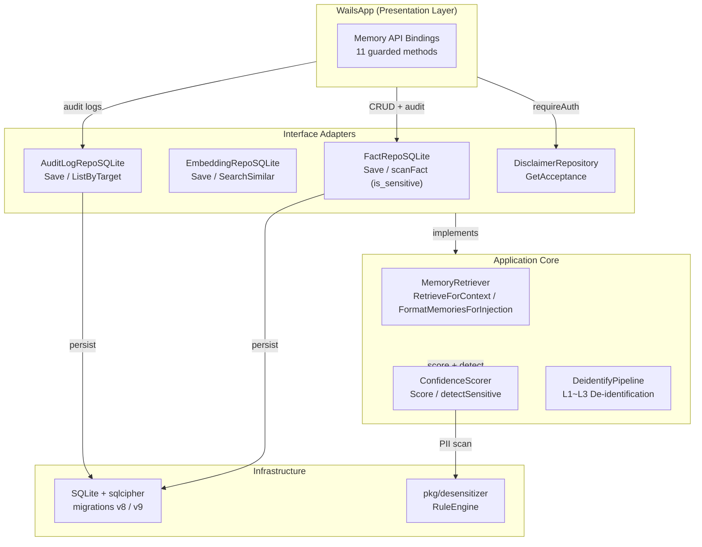

# v1.1 Memory Injection Enhancement — Architecture Design

> 🌐 [中文版本](../i18n/zh-Hans-CN/design/v1.1-memory-injection-enhancement.md)

> This document describes the architectural design, data model evolution, and module-level decisions introduced in MedMemo v1.1 (TASK-059 memory injection enhancement). It covers three functional increments: sensitive data tagging, local authorization guards, and audit logging.

---

## 1. Overview

v1.1 enhances the memory injection subsystem with three safety and compliance-oriented features:

| Increment | Feature | Motivation |
|:---|:---|:---|
| A1 | `is_sensitive` flag on extracted facts | Prevent sensitive PII from being silently injected into LLM prompts |
| A2 | Local authorization check for memory APIs | Ensure memory management operations require explicit user consent |
| A3 | Audit logging for memory mutations | Provide an immutable trail for compliance review and debugging |

All changes adhere to the existing Clean Architecture four-layer model and maintain backward compatibility with the v1.0 provider configuration system.

---

## 2. System Design

### 2.1 Component Diagram



### 2.2 Data Flow — Memory Injection with Sensitivity Guard

```
User Input
  → ChatOrchestrator
    → MemoryRetriever.RetrieveForContext
      → detectEntityMentions (keyword matching)
      → Semantic Search (sqlite-vec cosine similarity)
      → Confidence Scoring + Sensitivity Detection
        → desensitizer.RuleEngine scans subject/predicate/object
        → Mark IsSensitive = true if PII found
      → Token Budget Check (max 20% of system prompt)
      → FormatMemoriesForInjection
        → Skip IsSensitive facts unless explicitly approved
        → Inject formatted memory text into system prompt
    → LLMClient (OpenAI/Kimi/Ollama)
```

### 2.3 Data Flow — Authorized Memory API Call

```
Frontend Memory Management Action (Approve / Reject / Delete)
  → WailsApp API method
    → requireAuth()
      → DisclaimerRepository.GetAcceptance()
        → If nil → return ErrUnauthorized
    → Execute business logic (update fact status, delete memory)
    → AuditLogRepo.Save()
      → Record action, target, actor, timestamp
    → Return result to frontend
```

---

## 3. Data Model Evolution

### 3.1 Migration Timeline

| Version | Schema Change | Feature |
|:---|:---|:---|
| v7 | Baseline three-layer memory tables (`raw_dialogues`, `extracted_facts`, `semantic_embeddings`) | v1.0 memory foundation |
| **v8** | `ALTER TABLE extracted_facts ADD COLUMN is_sensitive INTEGER DEFAULT 0` | **A1** |
| **v9** | `CREATE TABLE audit_logs (...)` + `CREATE INDEX idx_audit_target` | **A3** |

### 3.2 `extracted_facts` — Post-v8 Schema

```sql
CREATE TABLE extracted_facts (
    fact_id TEXT PRIMARY KEY,
    subject TEXT NOT NULL,
    predicate TEXT NOT NULL,
    object TEXT NOT NULL,
    confidence REAL NOT NULL,
    source_msg_ids TEXT NOT NULL,
    status TEXT NOT NULL,
    scored_at INTEGER,
    reviewed_at INTEGER,
    created_at INTEGER NOT NULL,
    is_sensitive INTEGER DEFAULT 0   -- ← v1.1 A1
);
```

### 3.3 `audit_logs` — v9 New Table

```sql
CREATE TABLE audit_logs (
    id INTEGER PRIMARY KEY AUTOINCREMENT,
    action TEXT NOT NULL,
    target_type TEXT NOT NULL,
    target_id TEXT NOT NULL,
    old_value TEXT,
    new_value TEXT,
    actor TEXT NOT NULL,
    timestamp INTEGER NOT NULL
);
CREATE INDEX idx_audit_target ON audit_logs(target_type, target_id);
```

### 3.4 Entity Changes

**`ExtractedFact`** (`internal/domain/entity/memory_v2.go`)

```go
type ExtractedFact struct {
    FactID       string
    Subject      string
    Predicate    string
    Object       string
    Confidence   float64
    SourceMsgIDs []string
    Status       FactStatus
    ScoredAt     *time.Time
    ReviewedAt   *time.Time
    CreatedAt    time.Time
    IsSensitive  bool   // ← v1.1 A1
}
```

**`AuditLogEntry`** (`internal/domain/entity/audit_log.go` — A3)

```go
type AuditAction string

const (
    AuditActionCreate  AuditAction = "CREATE"
    AuditActionApprove AuditAction = "APPROVE"
    AuditActionReject  AuditAction = "REJECT"
    AuditActionDelete  AuditAction = "DELETE"
)

type AuditLogEntry struct {
    ID         string
    Action     AuditAction // e.g., CREATE, APPROVE, REJECT, DELETE
    TargetType string      // e.g., fact, memory
    TargetID   string
    OldValue   string      // JSON, optional
    NewValue   string      // JSON, optional
    Actor      string      // e.g., system, user
    Timestamp  time.Time
}
```

---

## 4. Module Design

### 4.1 A1 — Sensitive Data Tagging (`ConfidenceScorer`)

**Location**: `internal/application/usecase/confidence_scorer.go`

**Design Decision**: Sensitivity detection is integrated into the existing `ConfidenceScorer.Score()` method rather than creating a separate pipeline stage. This ensures every fact is scored and scanned in a single pass, minimizing latency.

**Key Implementation**:

```go
type ConfidenceScorer struct {
    // ... existing weight fields ...
    detector *desensitizer.RuleEngine   // ← v1.1
}

func (s *ConfidenceScorer) Score(f *entity.ExtractedFact) float64 {
    // ... existing scoring logic ...
    if s.detector != nil {
        f.IsSensitive = s.detectSensitive(f)
    }
    return score
}
```

**Why `desensitizer.RuleEngine` (L1 rules) instead of NER ONNX (L2)?**

- L1 rules cover ID numbers, phone numbers, bank cards, emails, and URLs with <1ms latency.
- L2 NER (Hugot + ONNX) is reserved for the upstream de-identification pipeline that processes raw user input.
- For fact sensitivity scanning, L1 is sufficient because facts are already structured (subject/predicate/object triples) and unlikely to contain novel entity types beyond standard PII.

**Storage Encoding**: `boolToInt(f.IsSensitive)` maps `true` → `1`, `false` → `0` for SQLite `INTEGER` compatibility. The same `boolToInt` helper is reused across the repository layer to avoid duplicate definitions.

### 4.2 A2 — Local Authorization (`requireAuth`)

**Location**: `wails_app.go` (all 11 memory API methods)

**Design Decision**: Reuse the existing `DisclaimerRepository` rather than introducing a new auth mechanism. The disclaimer acceptance record already captures the user's explicit consent to use the application. Memory management operations are gated behind this consent.

**Guarded Methods**:

| Method | Action Type |
|:---|:---|
| `ListPendingFacts` | READ |
| `ListApprovedFacts` | READ |
| `ListRejectedFacts` | READ |
| `ApproveFact` | WRITE + audit |
| `RejectFact` | WRITE + audit |
| `DeleteMemory` | WRITE + audit |
| `ListMemoriesBySubject` | READ |
| `SearchMemories` | READ |
| `GetMemoryStats` | READ |
| `SetMemoryEnabled` | WRITE |
| `SetSessionMemoryEnabled` | WRITE |

**Error Contract**: Unauthorized requests return `entity.ErrUnauthorized` wrapped with context:

```go
return fmt.Errorf("unauthorized: %w", entity.ErrUnauthorized)
```

### 4.3 A3 — Audit Logging

**Location**: `internal/adapters/repository/audit_log_repo.go`

**Design Decision**: Write-ahead audit logging — the audit record is persisted **before** the business mutation is considered successful. This ensures no mutation occurs without a corresponding log entry.

**Audit Action Types**:

| Action | Target Type | Triggered By |
|:---|:---|:---|
| `APPROVE` | `fact` | `WailsApp.ApproveFact()` |
| `REJECT` | `fact` | `WailsApp.RejectFact()` |
| `DELETE` | `memory` | `WailsApp.DeleteMemory()` |

**Why no audit for READ operations?**

- The audit log focuses on **data mutations** to minimize storage growth.
- READ operations are logged at the application event level (Wails Events) for debugging, not in the compliance audit trail.

---

## 5. Clean Architecture Compliance

### 5.1 Dependency Verification

| Layer | New Imports | Violation? |
|:---|:---|:---:|
| `domain` | Standard library only | ✅ No violation |
| `application` | `pkg/desensitizer` (existing public lib) | ✅ No violation |
| `adapters/repository` | `internal/domain/*`, `internal/infrastructure/database` | ✅ No violation |
| `infrastructure/database` | Standard library + sqlcipher | ✅ No violation |
| `cmd` | All layers (Wire assembly only) | ✅ No violation |

### 5.2 Interface Ownership

- `AuditLogRepository` interface is defined in `internal/domain/repository/` (consumer-side declaration), implemented by `AuditLogRepoSQLite` in `internal/adapters/repository/`.
- This follows the existing pattern established by `MemoryRepository`, `FamilyRepository`, etc.

---

## 6. Performance & Resource Impact

### 6.1 A1 — Sensitivity Detection Overhead

| Metric | Value | Budget |
|:---|:---|:---|
| L1 rule scan latency | ~0.5ms per fact | <1ms ✅ |
| Memory overhead per `ConfidenceScorer` | ~1MB (Aho-Corasick trie) | N/A |
| Storage overhead per fact | +1 byte (`is_sensitive` column) | Negligible |

### 6.2 A2 — Authorization Check Overhead

| Metric | Value | Budget |
|:---|:---|:---|
| `GetAcceptance` query latency | ~0.1ms (SQLite indexed) | <1ms ✅ |
| Check frequency | Once per API call | N/A |

### 6.3 A3 — Audit Log Write Overhead

| Metric | Value | Budget |
|:---|:---|:---|
| `Save` latency | ~0.5ms (SQLite serialized write) | <1ms ✅ |
| Storage growth | ~200 bytes per mutation event | <1MB/month at normal usage |

---

## 7. Security & Privacy Considerations

### 7.1 PII Prevention in Prompt Injection

Facts marked `IsSensitive = true` are excluded from `FormatMemoriesForInjection` output unless explicitly approved by the user. This prevents accidental leakage of health identifiers, contact information, or names into LLM prompts.

### 7.2 Consent-Gated Operations

All memory mutations require prior disclaimer acceptance. This aligns with MedMemo's informed-consent flow (documented in `docs/COMPLIANCE.md`) and ensures users cannot accidentally trigger data-destructive operations before understanding the application's boundaries.

### 7.3 Immutable Audit Trail

The `audit_logs` table is append-only. There is no `UPDATE` or `DELETE` API exposed for audit entries. In a future version, this table may be migrated to an append-only encrypted log (e.g., SQLite with `PRAGMA secure_delete` + WAL mode).

---

## 8. Testing Strategy

### 8.1 Coverage Summary

| Package | Tests | Coverage | Target |
|:---|:---:|:---:|:---:|
| `internal/application/usecase` | 40+ | **83.9%** | ≥80% ✅ |
| `internal/adapters/repository` | 45+ | **81.8%** | ≥80% ✅ |
| `internal/adapters/ai` | 30+ | **83.5%** | ≥80% ✅ |

### 8.2 Key Test Scenarios

- **Sensitivity detection**: Facts containing phone numbers, IDs, or emails are correctly flagged.
- **Auth guard**: Unauthenticated requests to all 11 memory APIs return `ErrUnauthorized`.
- **Audit logging**: `ApproveFact`, `RejectFact`, and `DeleteMemory` each produce exactly one audit record.
- **Migration idempotency**: Running migration v8 and v9 on an already-migrated database is a no-op.

---

## 9. Extension Points

### 9.1 Future Sensitivity Levels

The current `is_sensitive` is a boolean flag. A future version may migrate to the `SensitivityLevel` enum defined in `pkg/desensitizer/`:

```go
const (
    P1Public     SensitivityLevel = iota // Public, no treatment needed
    P2Internal                           // Soft replacement (recoverable)
    P3Confidential                       // Hard replacement (irreversible)
)
```

This would allow differentiated handling: P2 facts could be injected with placeholder masking, while P3 facts would be completely excluded.

### 9.2 Audit Log Query API

The current `ListByTarget` supports filtering by target type and ID. A future admin dashboard may need:

- Time-range queries (`WHERE timestamp BETWEEN ? AND ?`)
- Action-type aggregation (`GROUP BY action`)
- Actor-based filtering

These can be added as new repository methods without changing the table schema.

---

## 10. Related Documents

| Document | Path |
|:---|:---|
| Clean Architecture ADR | `docs/adr/001-clean-architecture.md` |
| De-identification Architecture | `docs/COMPLIANCE.md` |
| v1.0 Provider Configuration | `docs/design/v1.0-config-driven-design.md` |
| Prompt Engineering Guide | `docs/design/v1.1-prompt-engineering.md` |
| Integration Test Report | `docs/INTEGRATION_REPORT_v1.1.md` |

---

> **Last Updated**: 2026-07-09
>
> **Status**: ✅ Accepted
>
> **Scope**: v1.1 (TASK-059 memory injection enhancement)
