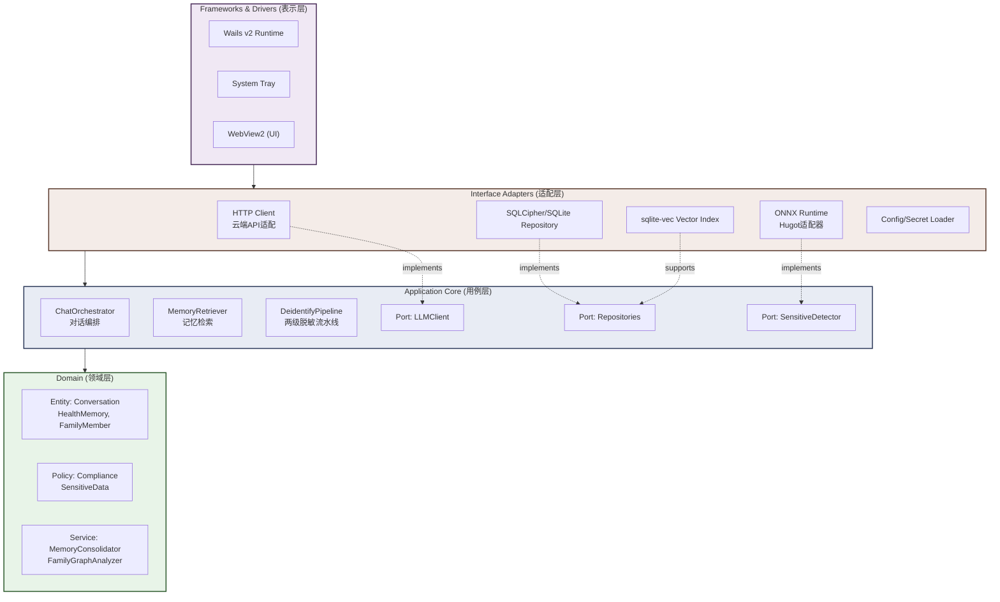

# 架构文档

> 🌐 [English Version](../../ARCHITECTURE.md)

> 本文档说明 MedMemo 的系统架构设计、模块划分与关键决策。面向开发团队、技术评审者和开源贡献者。

---

## 系统架构总览



实线箭头 = 编译期依赖方向（外层→内层）。虚线箭头 = 接口实现关系（适配器实现应用层端口）。

---

## 四层架构映射

| 层级                       | 职责                                | 典型包路径                    | 编译依赖原则                |
|--------------------------|-----------------------------------|--------------------------|-----------------------|
| **Frameworks & Drivers** | Wails v2 前端桥接、系统托盘、窗口管理           | 仓库根（`main.go`、`wails_app*.go`、`wire.go`） | 仅允许依赖内层 interface     |
| **Interface Adapters**   | HTTP 客户端、SQLCipher/SQLite 仓库、ONNX 推理适配 | `internal/adapters/*`    | 依赖 Application 层定义的接口 |
| **Application Core**     | 用例编排、脱敏流水线、端口定义                   | `internal/application/*` | 不依赖任何外层，不依赖框架         |
| **Domain**               | 实体定义、领域服务、策略抽象                    | `internal/domain/*`      | **零外部依赖**，纯 Go 标准库    |

---

## 核心数据流

### 用户对话请求流

```
用户输入
  → Wails Frontend (React)
    → 后端 HTTP Handler (Wails Bindings)
      → ChatOrchestrator (用例编排)
        → DeidentifyPipeline (L1规则 → L2 NER)
          → 记忆检索 (SQLCipher/SQLite 关键词 + sqlite-vec 语义搜索)
            → 上下文组装 (L1工作记忆 + L2/L3检索结果)
              → LLMClient (OpenAI/Kimi/Ollama)
                → 流式响应分句缓冲
                  → 合规检测 (L1~L4)
                    → 输出还原 (P2占位符回填)
                      → Wails Events 推送前端
                        → 前端打字机效果渲染
```

### 记忆写入流

```
对话结束/归档触发
  → MemoryRetriever.ArchiveConversation
    → 对话摘要生成 (LLM / 规则模板)
      → 实体提取 (ONNX NER)
        → 冲突检测 (MemoryConsolidator)
          → [无冲突] 直接写入 SQLCipher/SQLite
          → [有冲突] 高亮冲突 → 请求用户确认 → 写入
            → 向量索引更新 (sqlite-vec)
```

---

## 模块依赖矩阵

```
                    domain   application   adapters   infrastructure   pkg
                  ┌────────┬─────────────┬──────────┬────────────────┬─────┐
domain            │   -    │      -      │    -     │       -        │  √  │
application       │   √    │      -      │    -     │       -        │  √  |
adapters          │   √    │      √      │    -     │       √        │  √  |
infrastructure    │   -    │      -      │    -     │       -        │  -  │
pkg               │   -    │      -      │    -     │       -        │  -  │
                  └────────┴─────────────┴──────────┴────────────────┴─────┘
```

`√` = 允许导入，`-` = 禁止导入。

---

## 关键设计决策（ADR 索引）

| ADR     | 主题       | 决策                              | 状态  |
|---------|----------|---------------------------------|-----|
| [ADR-001](adr/001-clean-architecture.md) | Clean Architecture 四层模型 | Robert C. Martin 的 Clean Architecture | 已采纳 |
| [ADR-002](adr/002-duckdb-selection.md) | 嵌入式分析数据库 | DuckDB/Kùzǔ 移入 v2+ 规划；v1.x 使用 SQLCipher/SQLite + sqlite-vec | v1.x 已替代 |
| [ADR-003](adr/003-multi-model-architecture.md) | 多模型 LLM 架构 | Provider-Factory with 6+ backends | 已采纳 |
| [ADR-004](adr/004-onnx-integration.md) | 本地 AI 推理 | Hugot + ONNX Runtime（int8 DistilBERT NER） | 已采纳 |

完整 ADR 文档位于 `docs/adr/` 目录。

---

## 编译产物形态

| 组件     | 体积预算        | 说明                                                |
|--------|-------------|---------------------------------------------------|
| 主二进制   | ~50MB       | Wails Runtime + Go 运行时 + 业务逻辑         |
| 资源目录   | ~100MB      | ONNX Runtime 原生库 + tokenizer 原生库 + ONNX 模型 + sqlite-vec 资源 + 前端资源 |
| **总计** | **< 150MB** | 单二进制 + 资源目录                                       |

支持平台：Windows 10+ / macOS 12+ / Linux (Ubuntu 20.04+)，架构 x64 与 ARM64。

---

*最后更新：2026-07-09*
