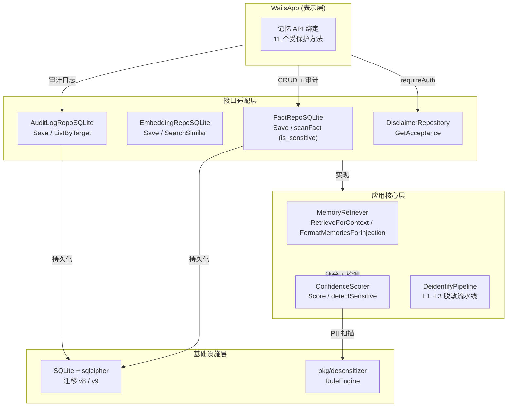

# v1.1 记忆注入增强 — 架构设计文档

> 🌐 [English Version](../../design/v1.1-memory-injection-enhancement.md)

> 本文档描述 MedMemo v1.1（TASK-059 记忆注入增强）的架构设计、数据模型演进和模块级决策。涵盖三个功能增量：敏感数据标记、本地授权检查和审计日志。

---

## 1. 概述

v1.1 为记忆注入子系统引入了三个以安全和合规为导向的功能：

| 增量 | 功能 | 动机 |
|:---|:---|:---|
| A1 | 提取事实的 `is_sensitive` 标记 | 防止敏感个人信息被静默注入 LLM 提示词 |
| A2 | 记忆 API 的本地授权检查 | 确保记忆管理操作需要用户明确同意 |
| A3 | 记忆变更的审计日志 | 为合规审查和调试提供不可变追溯链 |

所有变更均遵循现有的 Clean Architecture 四层模型，并与 v1.0 的 Provider 配置系统保持向后兼容。

---

## 2. 系统设计

### 2.1 组件图



### 2.2 数据流 — 带敏感度保护的记忆注入

```
用户输入
  → ChatOrchestrator
    → MemoryRetriever.RetrieveForContext
      → detectEntityMentions（关键词匹配）
      → 语义搜索（sqlite-vec 余弦相似度）
      → 置信度评分 + 敏感度检测
        → desensitizer.RuleEngine 扫描 subject/predicate/object
        → 发现 PII 则标记 IsSensitive = true
      → Token 预算检查（不超过系统提示词预算的 20%）
      → FormatMemoriesForInjection
        → 跳过 IsSensitive 为 true 的事实（除非用户明确批准）
        → 将格式化后的记忆文本注入系统提示词
    → LLMClient（OpenAI/Kimi/Ollama）
```

### 2.3 数据流 — 受授权保护的记忆 API 调用

```
前端记忆管理操作（批准 / 拒绝 / 删除）
  → WailsApp API 方法
    → requireAuth()
      → DisclaimerRepository.GetAcceptance()
        → 若返回 nil → 返回 ErrUnauthorized
    → 执行业务逻辑（更新事实状态、删除记忆）
    → AuditLogRepo.Save()
      → 记录操作、目标对象、执行者、时间戳
    → 返回结果给前端
```

---

## 3. 数据模型演进

### 3.1 迁移时间线

| 版本 |  Schema 变更 | 功能 |
|:---|:---|:---|
| v7 | 三层记忆基线表（`raw_dialogues`、`extracted_facts`、`semantic_embeddings`） | v1.0 记忆基础 |
| **v8** | `ALTER TABLE extracted_facts ADD COLUMN is_sensitive INTEGER DEFAULT 0` | **A1** |
| **v9** | `CREATE TABLE audit_logs (...)` + `CREATE INDEX idx_audit_target` | **A3** |

### 3.2 `extracted_facts` — v8 后 Schema

```sql
CREATE TABLE extracted_facts (
    fact_id TEXT PRIMARY KEY,
    subject TEXT NOT NULL,
    predicate TEXT NOT NULL,
    object TEXT NOT NULL,
    confidence REAL NOT NULL,
    source_msg_ids TEXT NOT NULL,
    status TEXT NOT NULL,
    scored_at INTEGER,
    reviewed_at INTEGER,
    created_at INTEGER NOT NULL,
    is_sensitive INTEGER DEFAULT 0   -- ← v1.1 A1
);
```

### 3.3 `audit_logs` — v9 新表

```sql
CREATE TABLE audit_logs (
    id INTEGER PRIMARY KEY AUTOINCREMENT,
    action TEXT NOT NULL,
    target_type TEXT NOT NULL,
    target_id TEXT NOT NULL,
    old_value TEXT,
    new_value TEXT,
    actor TEXT NOT NULL,
    timestamp INTEGER NOT NULL
);
CREATE INDEX idx_audit_target ON audit_logs(target_type, target_id);
```

### 3.4 实体变更

**`ExtractedFact`**（`internal/domain/entity/memory_v2.go`）

```go
type ExtractedFact struct {
    FactID       string
    Subject      string
    Predicate    string
    Object       string
    Confidence   float64
    SourceMsgIDs []string
    Status       FactStatus
    ScoredAt     *time.Time
    ReviewedAt   *time.Time
    CreatedAt    time.Time
    IsSensitive  bool   // ← v1.1 A1
}
```

**`AuditLogEntry`**（`internal/domain/entity/audit_log.go` — A3）

```go
type AuditAction string

const (
    AuditActionCreate  AuditAction = "CREATE"
    AuditActionApprove AuditAction = "APPROVE"
    AuditActionReject  AuditAction = "REJECT"
    AuditActionDelete  AuditAction = "DELETE"
)

type AuditLogEntry struct {
    ID         string
    Action     AuditAction // 如 CREATE、APPROVE、REJECT、DELETE
    TargetType string      // 如 fact、memory
    TargetID   string
    OldValue   string      // JSON，可选
    NewValue   string      // JSON，可选
    Actor      string      // 如 system、user
    Timestamp  time.Time
}
```

---

## 4. 模块设计

### 4.1 A1 — 敏感数据标记（`ConfidenceScorer`）

**位置**：`internal/application/usecase/confidence_scorer.go`

**设计决策**：将敏感度检测集成到现有的 `ConfidenceScorer.Score()` 方法中，而非创建单独的流水线阶段。这确保每个事实在单次遍历中同时完成评分和扫描，最小化延迟。

**关键实现**：

```go
type ConfidenceScorer struct {
    // ... 现有权重字段 ...
    detector *desensitizer.RuleEngine   // ← v1.1
}

func (s *ConfidenceScorer) Score(f *entity.ExtractedFact) float64 {
    // ... 原有评分逻辑 ...
    if s.detector != nil {
        f.IsSensitive = s.detectSensitive(f)
    }
    return score
}
```

**为何使用 `desensitizer.RuleEngine`（L1 规则）而非 NER ONNX（L2）？**

- L1 规则覆盖身份证号、手机号、银行卡号、邮箱和 URL，延迟 <1ms
- L2 NER（Hugot + ONNX）保留给上游处理原始用户输入的脱敏流水线
- 对于事实敏感度扫描，L1 已足够，因为事实已是结构化数据（主谓宾三元组），不太可能包含标准 PII 之外的新型实体

**存储编码**：`boolToInt(f.IsSensitive)` 将 `true` → `1`、`false` → `0`，以兼容 SQLite `INTEGER` 类型。同一 `boolToInt` 辅助函数在仓库层复用，避免重复定义。

### 4.2 A2 — 本地授权（`requireAuth`）

**位置**：`wails_app.go`（全部 11 个记忆 API 方法）

**设计决策**：复用现有的 `DisclaimerRepository`，而非引入新的认证机制。免责声明同意记录已包含用户使用应用的明确同意。记忆管理操作在此同意基础上进行管控。

**受保护方法**：

| 方法 | 操作类型 |
|:---|:---|
| `ListPendingFacts` | 读取 |
| `ListApprovedFacts` | 读取 |
| `ListRejectedFacts` | 读取 |
| `ApproveFact` | 写入 + 审计 |
| `RejectFact` | 写入 + 审计 |
| `DeleteMemory` | 写入 + 审计 |
| `ListMemoriesBySubject` | 读取 |
| `SearchMemories` | 读取 |
| `GetMemoryStats` | 读取 |
| `SetMemoryEnabled` | 写入 |
| `SetSessionMemoryEnabled` | 写入 |

**错误契约**：未授权请求返回带上下文的 `entity.ErrUnauthorized`：

```go
return fmt.Errorf("unauthorized: %w", entity.ErrUnauthorized)
```

### 4.3 A3 — 审计日志

**位置**：`internal/adapters/repository/audit_log_repo.go`

**设计决策**：写前审计日志 — 审计记录在业务变更**成功之前**持久化。这确保没有变更会在无对应日志条目的情况下发生。

**审计操作类型**：

| 操作 | 目标类型 | 触发来源 |
|:---|:---|:---|
| `APPROVE` | `fact` | `WailsApp.ApproveFact()` |
| `REJECT` | `fact` | `WailsApp.RejectFact()` |
| `DELETE` | `memory` | `WailsApp.DeleteMemory()` |

**为何不对读取操作记审计？**

- 审计日志聚焦于**数据变更**，以最小化存储增长
- 读取操作在应用事件层（Wails Events）记录，用于调试，不计入合规审计追踪

---

## 5. Clean Architecture 合规性

### 5.1 依赖验证

| 层级 | 新增导入 | 违规？ |
|:---|:---|:---:|
| `domain` | 仅标准库 | ✅ 无违规 |
| `application` | `pkg/desensitizer`（现有公共库） | ✅ 无违规 |
| `adapters/repository` | `internal/domain/*`、`internal/infrastructure/database` | ✅ 无违规 |
| `infrastructure/database` | 标准库 + sqlcipher | ✅ 无违规 |
| `cmd` | 所有层级（仅 Wire 组装） | ✅ 无违规 |

### 5.2 接口所有权

- `AuditLogRepository` 接口定义在 `internal/domain/repository/`（消费端声明），由 `internal/adapters/repository/` 的 `AuditLogRepoSQLite` 实现
- 这遵循了 `MemoryRepository`、`FamilyRepository` 等已确立的现有模式

---

## 6. 性能与资源影响

### 6.1 A1 — 敏感度检测开销

| 指标 | 值 | 预算 |
|:---|:---|:---|
| L1 规则扫描延迟 | ~0.5ms/事实 | <1ms ✅ |
| `ConfidenceScorer` 内存开销 | ~1MB（Aho-Corasick trie） | N/A |
| 每事实存储开销 | +1 字节（`is_sensitive` 列） | 可忽略 |

### 6.2 A2 — 授权检查开销

| 指标 | 值 | 预算 |
|:---|:---|:---|
| `GetAcceptance` 查询延迟 | ~0.1ms（SQLite 索引） | <1ms ✅ |
| 检查频率 | 每次 API 调用一次 | N/A |

### 6.3 A3 — 审计日志写入开销

| 指标 | 值 | 预算 |
|:---|:---|:---|
| `Save` 延迟 | ~0.5ms（SQLite 串行化写入） | <1ms ✅ |
| 存储增长 | ~200 字节/变更事件 | 正常使用 <1MB/月 |

---

## 7. 安全与隐私考量

### 7.1 提示词注入中的 PII 防护

标记为 `IsSensitive = true` 的事实默认被排除在 `FormatMemoriesForInjection` 输出之外。这防止健康标识符、联系方式或姓名意外泄漏到 LLM 提示词中。

### 7.2 同意门槛操作

所有记忆变更都需要事先的免责声明同意。这与 MedMemo 的知情同意流程（记录在 `docs/COMPLIANCE.md`）一致，确保用户在理解应用边界之前不会意外触发数据破坏性操作。

### 7.3 不可变审计追踪

`audit_logs` 表仅支持追加。不暴露 `UPDATE` 或 `DELETE` API。未来版本可能将此表迁移到仅追加的加密日志（如 SQLite `PRAGMA secure_delete` + WAL 模式）。

---

## 8. 测试策略

### 8.1 覆盖率汇总

| 包 | 测试数 | 覆盖率 | 目标 |
|:---|:---:|:---:|:---:|
| `internal/application/usecase` | 40+ | **83.9%** | ≥80% ✅ |
| `internal/adapters/repository` | 45+ | **81.8%** | ≥80% ✅ |
| `internal/adapters/ai` | 30+ | **83.5%** | ≥80% ✅ |

### 8.2 关键测试场景

- **敏感度检测**：包含手机号、身份证号或邮箱的事实被正确标记
- **授权守卫**：所有 11 个记忆 API 的未认证请求返回 `ErrUnauthorized`
- **审计日志**：`ApproveFact`、`RejectFact`、`DeleteMemory` 各产生恰好一条审计记录
- **迁移幂等性**：在已迁移的数据库上重新运行 v8 和 v9 迁移是无操作

---

## 9. 扩展点

### 9.1 未来敏感度级别

当前 `is_sensitive` 是布尔标记。未来版本可能迁移到 `pkg/desensitizer/` 中定义的 `SensitivityLevel` 枚举：

```go
const (
    P1Public     SensitivityLevel = iota // 公开，无需处理
    P2Internal                           // 软替换（可恢复）
    P3Confidential                       // 硬替换（不可逆）
)
```

这将支持差异化处理：P2 事实可以带占位符掩码注入，P3 事实则被完全排除。

### 9.2 审计日志查询 API

当前 `ListByTarget` 支持按目标类型和 ID 过滤。未来的管理后台可能需要：

- 时间范围查询（`WHERE timestamp BETWEEN ? AND ?`）
- 操作类型聚合（`GROUP BY action`）
- 按执行者过滤

这些可作为新仓库方法添加，无需变更表结构。

---

## 10. 相关文档

| 文档 | 路径 |
|:---|:---|
| Clean Architecture ADR | `docs/adr/001-clean-architecture.md` |
| 脱敏架构设计 | `docs/adr/007-deidentification-architecture.md` |
| v1.0 Provider 配置设计 | `docs/design/v1.0-config-driven-design.md` |
| Prompt 工程指南 | `docs/design/v1.1-prompt-engineering.md` |
| 联调测试报告 | `docs/INTEGRATION_REPORT_v1.1.md` |

---

> **最后更新**：2026-05-25
>
> **状态**：✅ 已接受
>
> **范围**：v1.1（TASK-059 记忆注入增强）
